A foundation model for mobiles, wearables, robots, smart home, automotive and microcontrollers. The whole model is a single 8-29 MB binary built on our Simple Attention Network, and we trade general chat capacity to beat models 10x its size on mobile tool calls and match 2-3x bigger models on extraction.

- **Tool calls**: given the functions your app exposes, Needle picks the right ones and fills every argument from what the user said. Ask for two things and you get two calls in order; ask for something no tool covers and you get an empty list, not a guess.
- **Structured extraction**: declare a shape, hand over messy text, get typed fields back: an invoice, a booking, a notification, a form. The decode grammar guarantees the output parses, and extraction generalises to classification.
- **Text embedding**: the same model returns a vector for a sentence, so an app can search, match and route locally.



Needle 3 is a Laddered Simple Attention Network: a Monarch Hadamard MLP in place of the FFN, GQA attention with causal conv taps, engram n-gram memory read by gather, and multi-lane hyper-connections, trained so that every depth from 2 to 20 layers is a deployable model. Most of its parameters sit in the engram, so the 121M model does the arithmetic of a 50M one. A byte-level grammar compiled from your schemas constrains every token, and every response carries a calibrated confidence score from a learned head. The architecture diagram is on the [release page](https://cactuscompute.com/needle).

## Benchmarks

Tool calling is exact-match accuracy on the full test splits, extraction is field micro-F1 on the full test splits.



The interactive frontier plot, the architecture and the fine-tuning results are at [cactuscompute.com/needle](https://cactuscompute.com/needle).

## Get started

```sh
pip install cactus-needle
```

Try it in the browser at [cactuscompute.com/needle](https://cactuscompute.com/needle); the weights and every platform engine are on [Hugging Face](https://huggingface.co/Cactus-Compute/needle3).

Decorate a function: the signature gives the argument types, the docstring is the tool description, and `run()` completes the loop, executing your function and returning its results.

```python
import needle

@needle.tool
def get_weather(city: str):
    "Get the current weather for a city."
    return {"city": city, "temp_c": 27, "sky": "clear"}

agent = needle.Needle(tools=[get_weather])
print(agent.run("what's it like in Lagos right now?")["results"])
# [{'city': 'Lagos', 'temp_c': 27, 'sky': 'clear'}]
```

Every turn returns one JSON object with `function_calls`, the model's `reasoning` and a calibrated `confidence`; an off-topic request returns an empty list rather than a guess. `needle.Needle(tools=[...], generation=2)` keeps running Needle 2 for existing deployments.

## Guides

- [How to design tools for Needle 3](https://cactuscompute.com/blog/designing-tools-for-needle): one tool per action, names users would say, formats in descriptions, constraints in the grammar, triggers.
- [Leveraging Needle's confidence](https://cactuscompute.com/blog/needle-confidence): what the score measures, what the engine withholds, and routing on act, confirm or refuse.
- [Structured JSON extraction with Needle](https://cactuscompute.com/blog/structured-extraction-with-needle): the record as the only tool, typed results, classification with enums.
- [Fine-tuning Needle](https://cactuscompute.com/blog/finetuning-needle): the data format, the commands, reading the loss, sizing the dataset.
- [Needle Python docs](https://cactuscompute.com/blog/needle-python-docs): the API, the response shape, the behaviour contract, system facts, tool retrieval, offline devices, environments, the CLI.
- [What devices are supported on Needle](https://cactuscompute.com/blog/needle-supported-devices): every platform folder, the CLI runner, the C API, the browser, WASI, air-gapped setup.
- [The .cact format](https://cactuscompute.com/blog/cact-format): the file the engine maps and reads in place, Cactus Quants at 2.125 bits per weight, and how to parse it yourself.

`llms.txt` in this repo carries the same reference for AI coding assistants.

## Customisation

Needle was designed to be customised. Its capacity is a ladder, and a subnetwork as small as 2 layers, fine-tuned on one product's tools, runs optimally on devices far smaller than the full model needs. Fine-tuning on DroidCall lifts every subnetwork by 18 to 36 points, and from 4 layers up the tuned subnetwork passes DeepSeek V4 Flash, starting at 29M parameters.



```sh
pip install "cactus-needle[train]"
needle finetune data.jsonl --epochs 10 --out adapter.safetensors
needle build --lora adapter.safetensors --layers 8 --out tuned.cact
```

Local fine-tuning trains and exports at 4 bits; the [fine-tuning guide](https://cactuscompute.com/blog/finetuning-needle) has the rest. The 2-bit post-training and quantisation behind the shipped model, enriched with Cactus proprietary datasets, run on the [Cactus Platform](https://cactuscompute.com/dashboard).

## Deploy

Every deployment target ships a prebuilt engine under 1 MB that loads the `needle3.cact` weights at start. `needle build --platform <folder> [--layers N]` fetches that engine and puts the weights beside it.



```sh
needle build --platform macos-arm64
needle build --platform linux-arm64 --layers 8 --out ./pi
./macos-arm64/needle --model needle3.cact --tools tools.json --serve
```

The [devices guide](https://cactuscompute.com/blog/needle-supported-devices) lists every folder and what ships in it.

By default, telemetry is turned on in the binary. To turn it off, set environment variables NEEDLE_TELEMETRY=0 and DO_NOT_TRACK=1. 

## Citation

Needle is built by the Cactus Compute team. If you use it in your work, please cite:

```bibtex
@misc{needle3_2026,
  title        = {Needle: Automation Foundation Model for Tiny Devices},
  author       = {Ndubuaku, Henry and Mosoyan, Karen and Mroz, Jakub and Cylich, Noah and
                  Kumar, Satyajit and Sandhu, Parkirat and Shemet, Roman and Lee, Justin H.},
  year         = {2026},
  organization = {Cactus Compute, Inc.},
  howpublished = {\url{https://github.com/cactus-compute/needle}}
}
```
